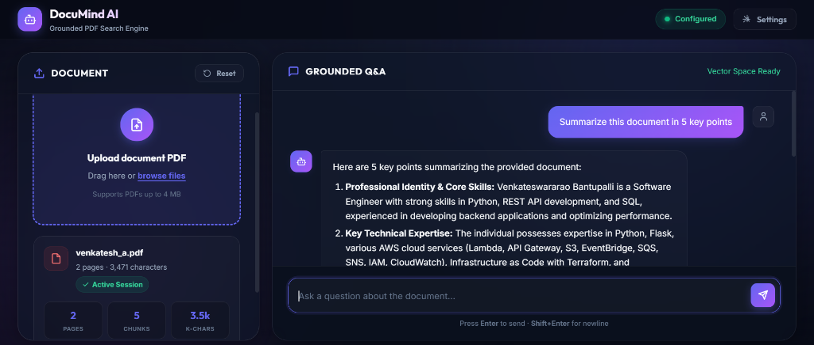
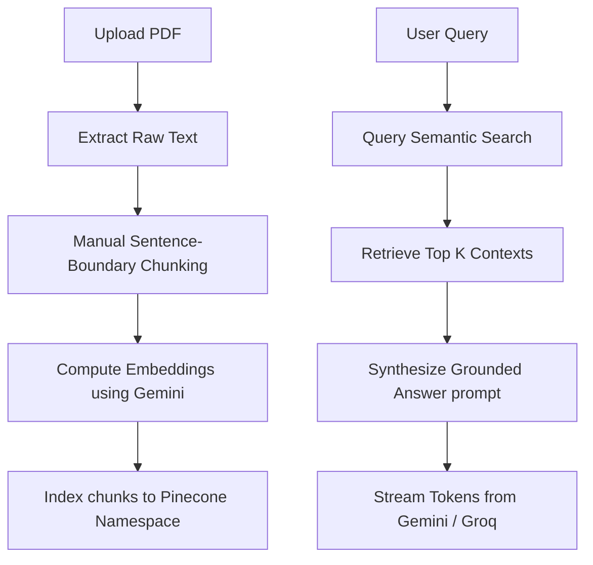

# 🧠 DocuMind AI

DocuMind AI is a premium, lightweight Retrieval-Augmented Generation (RAG) platform that lets you upload any PDF document and chat with it in real time. It extracts document content, computes high-dimensional vector embeddings, indexes them in a serverless Pinecone database, and streams grounded responses from Google Gemini or Groq Llama 3.3.

The interface is built using modern CSS glassmorphism, responsive viewports, and custom web animations—delivering a fluid mobile and desktop dashboard experience.

---

## 📸 Interface Preview

### Desktop Dashboard View


---

## ⚡ Key Features

- **Responsive Viewport Modes**: Fixed-height sidebar layout for desktop displays; tabbed application panel layout with sticky keyboard inputs for mobile devices.
- **Isolated User Sessions**: Dynamic namespace isolation in Pinecone ensures uploads are partitioned and secure.
- **SSE Token Streaming**: Answers are streamed to the client token-by-token for a seamless conversational feel.
- **Multi-Model Intelligence**: Configure the application to use either **Google Gemini 2.5 Flash** or **Groq Llama 3.3 (70B)**.
- **Client-Side Credential Storage**: Configure API keys safely inside an application settings panel. Keys are cached securely in your browser's local storage.
- **Grounded Context Citation**: The assistant displays exact source extracts and matching chunk IDs from the document, allowing verification of sources.

---

## 🛠️ Architecture Flow



---

## 🚀 Quick Start

### Prerequisites

- **Python 3.10+**
- A **Google Gemini API Key** (for calculating vector embeddings and generating answers).
- A **Pinecone API Key** (for document indexing).
- A **Groq API Key** (optional, for Llama 3.3 generation).

### Installation & Run

1. **Clone the repository**:
   ```bash
   git clone <your-repo-url>
   cd flask-rag
   ```

2. **Set up the virtual environment**:
   ```bash
   python -m venv .venv
   # Windows:
   .venv\Scripts\activate
   # macOS/Linux:
   source .venv/bin/activate
   ```

3. **Install python packages**:
   ```bash
   pip install -r requirements.txt
   ```

4. **Run the Flask local development server**:
   ```bash
   python api/index.py
   ```

5. **Access the application**:
   Open [http://localhost:5000](http://localhost:5000) in your web browser.

---

## 📂 Project Structure

```text
├── api/
│   └── index.py            # Flask server endpoints (Upload, Settings, Health, SSE Query)
├── lib/
│   ├── pdf.py              # PDF extraction & text structure parses
│   └── rag.py              # LangChain clients, Pinecone indexers, & query generators
├── templates/
│   └── index.html          # Responsive glassmorphic frontend UI & JavaScript RAG handler
├── requirements.txt        # Project dependencies
└── vercel.json             # Vercel Serverless deployment config
```

---

## 🔒 Configuration

You can configure your access keys either by setting environment variables in a `.env` file at the root or using the in-app **Settings panel** (cached in local storage):

```env
GOOGLE_API_KEY=your-gemini-key
PINECONE_API_KEY=your-pinecone-key
GROQ_API_KEY=your-groq-key-optional
```

---

## 📝 License

This project is open-source and licensed under the [MIT License](LICENSE).
